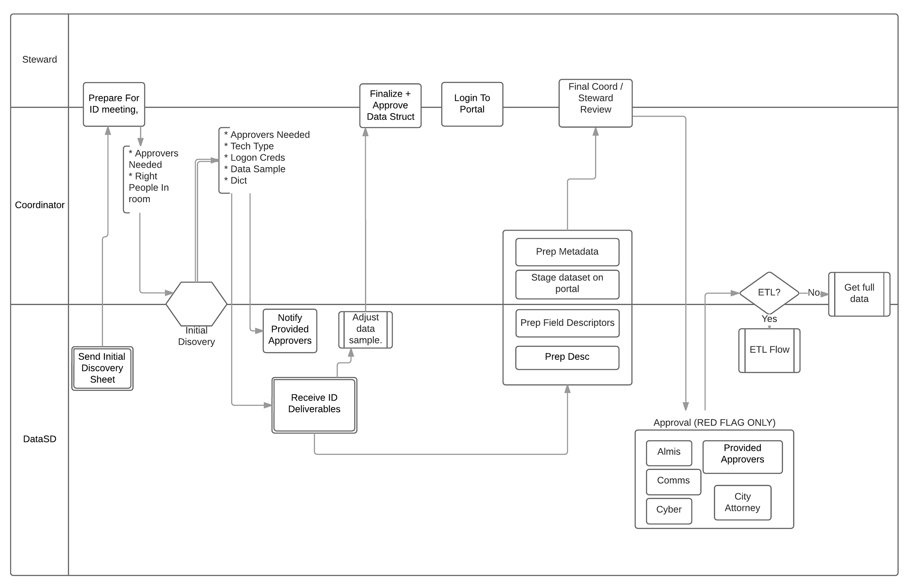

# Data release process

With prioritization complete, and 115 high-value public datasets to start with, we turned our attention to getting datasets ready for release. Starting at the top of the prioritized datasets, we began initiating a process for publication. As we made progress on one dataset, we started on the next. We were able to get 44 datasets through the process by the launch date of the portal, with several more in progress for release in the near future.

## The process

A flexible process guided our actions. Here is a general overview:

For the majority of datasets, we started with a meeting with the information coordinator who suggested the dataset to the inventory and, when possible, any data stewards and subject matter experts needed. The purpose of the meeting was to find out everything we could about the data and also establish a relationship with whomever was responsible for maintaining and updating the data. In some cases, the data is stored in systems a third-party maintains on a contractual basis for the City, and getting the cooperation of contractors and vendors was key.

Some of the questions we addressed through these meetings were:

* How did this dataset come to exist, and what function does it serve in City daily operations?

* What is the technology behind the system that stores the data?

* Has the data always been stored in the same place?

* Are there any plans to change where the data is stored or make updates to underlying technologies?

* What is the time period covered in the data? How far back can we rely on the quality of the data?

* What does each field mean, and what are the possible values for each field?

* Are there any special notes, circumstances or caveats we need to explain for users?

* How can we connect to the source system to build an automated extraction pipeline?

We then requested a sample of the data to work with so we could test out any transformations and get approval from departments before building our extraction, transformation and loading process for that particular dataset. We also collaborated with information coordinators on writing a title and description and choosing categories and tags.

Once a sample was finalized, we began the technical work of connecting to data sources, pulling in data, transforming it to match the approved samples, and exporting it for upload to the portal. We worked a variety of data sources, including Excel workbooks and text files stored on shared drives, relational databases, API endpoints, csv files vendors put onto FTP sites and shapefiles containing geographic data. For most of these sources, we had to request permission to access them. We used a piece of software that performs ETL, and supplemented with other programming languages when needed.

Well-described data is a cornerstone of our program. Each published dataset has an accompanying data dictionary. A data dictionary lists each field in the data and offers a definition for that field. For fields that have a set list of values, the possible values are listed, along with definitions of each of those, when necessary. For some datasets, we found it helpful to publish an additional reference dataset. A list of police call types is one example of this. A user who wants to work with the calls for police service dataset will find that the call type column has a code. Using our reference dataset, this user can join a text description to each call code to have a better understanding of each call.

## Case studies

Through our flexible process, we were able to perform the same quality of work releasing datasets from numerous systems on a variety of topics. The following are case studies on three datasets that illustrate more specifically how our process worked.

### EMTS water testing

The Environmental Monitoring and Technical Services division of the Public Utilities Department is responsible for monitoring the quality of drinking water. These activities result in a large quantity of data, some of which is included in an annual report on drinking water quality, and some of which is reported to the state. We knew from the voting results on the public inventory that people were interested in getting the results of tests on drinking water for indicator bacteria, and we also knew that a frequently updated dataset of individual test results was not currently available online.

Our kick-off meeting took place at the Alvarado labs facility in La Mesa. We met with two subject matter experts who gave us an introduction to the water testing program as well as a tour of their facility, so we could see some of the physical equipment that produces the results we would be publishing as well as get a look at the database that stores them.

The first thing we had to learn about was the Revised Total Coliform Rule. RTCR is a federal rule that governs how public water systems monitor drinking water for bacteria. According to the rule, the City must have a sampling plan that describes the locations of sites to routinely sample the drinking water and the frequency at which samples will be collected at each. This plan is approved by the state. Currently, the City has 160 sites, most of which are sampled weekly or monthly. Site samples are tested for coliform and its subgroup E. coli. Coliform are a group known as indicator bacteria since they are easier to test for than pathogenic bacteria. Any that test positive must be repeat tested at the original plus two additional sites. Only if the initial or a repeat sample is E. coli positive, or if greater than 5 percent of the monthly samples are positive for coliform, does the state, and in some case the public, have to be notified of a potential problem in the drinking water.

Learning the context of the data helped us understand important features of the dataset, such as how many records it might contain, and what some of the fields mean. We were able to identify this as a dataset that should be updated daily, based on how often tests are conducted and the fact that results are stored in a relational database. We identified the need to add the locations of sampling sites as an additional dataset onto the portal, as well as a view of the data that contains the monthly totals for tests that are reported to the state. Finally, writing a title, description and notes that were accurate but also easy for a wide audience to understand would have been difficult otherwise.

The meeting gave us an opportunity to learn about another closely related dataset, which was the results of tests for chemical and other nonbiological parameters, such as total dissolved solids and hardness. This data is reported monthly to the Safe Drinking Water Information System. Lab staff must collect the numbers to report, then report them through software provided by the state. The software exports a special type of text file that we used as the basis for our dataset.

Following the meeting, we worked with four samples to create datasets: A spreadsheet of sampling site locations and details, a spreadsheet containing the results of coliform tests for one month, six months’ worth of special text files for chemical parameters, and a spreadsheet template lab staff use to report monthly totals of coliform tests. These samples were prepared for staging on the portal, along with the titles, descriptions, notes and data dictionaries. Our subject matter experts and information coordinators were able to review all of the information and provide feedback.

Once final edits were made and approved on the data samples, we connected to the data sources with our ETL software. The data sources included a shared drive containing the special text files, an Excel spreadsheet, and a relational database. With live connections to the data sources established, these datasets were ready for the launch of the portal.

### Police

In April, we received some great news. The San Diego Police Department wanted to join the White House’s Police Data Initiative. The City was planning to commit to releasing three Police Department datasets: calls for service, vehicle stops, and community engagement numbers. With the timing nearly coinciding with the launch of the portal, we wanted to get at least one of those out to the public with the launch.

We met with a PD data steward to discuss how to best release the calls for service data on the portal. To establish a direct connection to the PD CAD (Computer Aided Dispatch) replication database, we would have had to complete a rigorous background check to fulfill necessary law enforcement security requirements. Instead, we worked out an arrangement in which a PD analyst set up an automatic daily query to dump the results to an FTP server. From there, an R script we wrote picks up the .csv files, performs deduplication, merges the new data into the existing dataset, and uploads the updated dataset to the portal. The PD team was great to work with, and they were able to quickly get the process up and running.

This process was significantly more complex and required more work than extracting directly from a database. Building the process for direct extraction would have taken about 12 hours once we knew which query to run, but the workaround we built took about two weeks. Still, that was shorter than the amount of time a rigorous background check would have taken to obtain direct access.

The Police Department also chose to filter out certain sensitive types of incidents from the data in order to preserve victim confidentiality. We made sure to define the data exclusions on the portal, and are hoping to continue to work with PD to further refine a more anonymized data sharing standard.

We learned an important lesson with this dataset that has informed our technical guidelines in the area of participating in and understanding data going into the portal. Since the PD extracted the data for this dataset directly from the CAD replication database, we did not initially understand which call codes were excluded, or how the addresses were abstracted; however, after reviewing the query used by the PD, we were able to accurately describe the data included on the portal.

As part of the Police Data Initiative, we'll be working further with the Police Department to release additional datasets such as community events and vehicle stop incidents.

### Machine traffic counts

The Transportation Engineering Operations Division of the Transportation and Stormwater Department studies traffic volume on certain street segments. These traffic counts are useful to City staff and people outside of the City, including real estate agents and economists. Staff in this division spend time responding to requests for traffic counts, so this dataset was targeted for early publication to the portal.

Through our meeting with the subject matter experts, we learned that the City contracts with a vendor to perform the traffic count by laying a hose on the street. The vendor then extracts data from the hose and creates a pdf report to send to the City via email. Staff in the division have been entering some key pieces of information from the pdf into a spreadsheet that keeps track of all traffic counts. A recent effort in the division to check and clean the data allowed us to use data all the way back to 2000.

The meeting also revealed opportunities for better technology to improve how this data is managed and made available internally and externally. If someone wants more details about a particular traffic count than what is published through the tracking spreadsheet, a division staff person must find the full pdf that was sent via email. These pdfs are stored on a shared drive. If we could store them in the cloud, we could link the pdfs to the records in the dataset that is currently published on the portal. With the pdfs so readily available, we could save staff time spent responding to requests for the pdfs. This is something we hope to implement in the future.

Because the dataset is a spreadsheet in a shared drive, we were easily able to connect live to the datasource through our ETL tool and transform it for the portal. Division staff wrote a title and description and provided us with a data dictionary. Once all of those pieces were in place, this dataset was ready for the launch of the portal.

