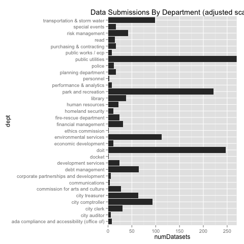
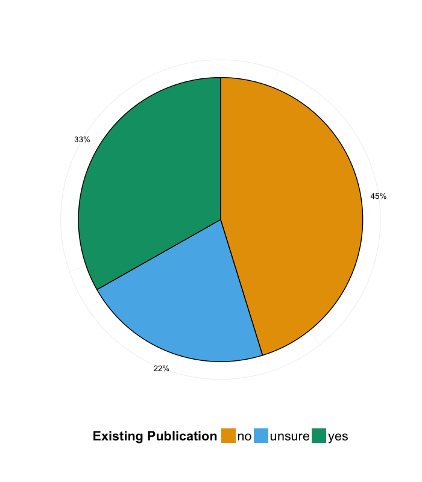
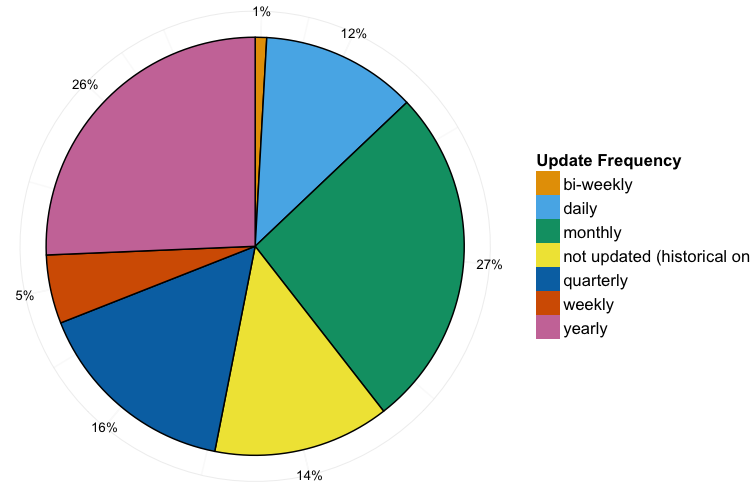
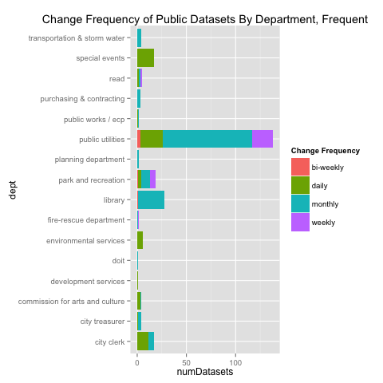

# Inventory Findings
It's important to recognize that this analysis is preliminary, and as the inventory is a living document, it will evolve.  These are meant to give a general high level overview of the inventory.  Since the inventory is human generated, there will need to be a lot of data cleaning as there are a number of values that do not fit into the validation criteria.  In addition, it is still necessary to merge information from sources that are not human generated.Finally, there are potential mistakes in data that can expose PII or cybersecurity vulnerabilities.  After we have verified the inventory data, we will be posting it for public review and updating this analysis.

## Submissions By Department
Since the departments that participated in the inventory are sized very differently, with different numbers of employees and are widely varying in the type of work that they do, submissions by department are interesting, but are in no way indicative of the quality of the the department's participation in the inventory.  In addition, as we proceed with the program, the inventory will become more robust and these numbers will only grow more accurate (this is a scripted report).

### Overall Submissions By Department
####Submission Counts

|dept                                         | numDatasets|
|:--------------------------------------------|-----------:|
|ada compliance and accessibility (office of) |           8|
|city auditor                                 |           6|
|city clerk                                   |          30|
|city comptroller                             |          93|
|city treasurer                               |          63|
|commission for arts and culture              |          27|
|communications                               |           4|
|corporate partnerships and development       |           6|
|debt management                              |          64|
|development services                         |          24|
|docket                                       |           2|
|doit                                         |         247|
|economic development                         |          11|
|environmental services                       |         112|
|ethics commission                            |           1|
|financial management                         |          31|
|fire-rescue department                       |          24|
|homeland security                            |          11|
|human resources                              |          22|
|library                                      |          38|
|park and recreation                          |         221|
|performance & analytics                      |           8|
|personnel                                    |           3|
|planning department                          |          16|
|police                                       |          12|
|public utilities                             |         749|
|public works / ecp                           |           8|
|purchasing & contracting                     |          17|
|read                                         |          14|
|risk management                              |          42|
|special events                               |          17|
|transportation & storm water                 |          99|

 

#### Submissions By Dept, adjusted Scale.
This is an adjusted graph with a smaller scale, clipping large outliers to be able to make a better comparison.

 

#### Insights
It's obvious we have a lot of data, and information coordinators worked extremely hard to make sure that they let Performance and Analytics know as much about it as they can.  

## Public Dataset Analysis
As part of the inventory process, departments are asked to assess which datasets they would consider to be already public, and if they are publishing them anywhere.  It's important to note that this has not been verified and there still remains to be a lot of work done per department to make sure these are correct.  Nevertheless, it's a good general overview.

### Public Datasets Per Department

 

#### Public Datasets, adjusted Scale.
This is an adjusted graph with a smaller scale, clipping large outliers to be able to make a better comparison.

 

#### Insights
As can be seen by the graphs above, there is quiet a bit of data that departments already consider to be public, but are not yet publishing it.  Or if they are, they are publishing it in disparate places and in disparate formats.  We envision these specific datasets to be a "low hanging" fruit.  Some examples include: 
* Capital Improvement Projects (PW).
* Library Locations and Hours (Library).
* Event Calendars (Parks).
* Vehicle Stop Details (PD).
* Business Tax Data (Treasurer).

### Change Frequency
In addition, due to the inventory, we are able to get a general overview of how fast the datasets are updated, and are able to make some guesses about what we will be targeting.  Once again, the data have not been fully cleaned yet, so there are outliers and inconsistencies.  Nevertheless, this is good for seeing the general pattern. 

#### Datasets with low-speed update cycles.
 

#### Datasets with fast update cycles.
 

#### Insight
The datasets that are updated less frequently are good low-hanging fruit targets, because they may not necessarily warrant a need for an automated process to publish data.  However, the datasets with faster rates of update will not be excluded as we're considering various ETL tools.  Examples of datasets already published, with low change frequency:
* Fire Hydrants (PUD)
* Storm Water Runoff Report (PUD)
* Business Improvement Distric (Economic Development)
* Rec Spaces (Parks and Rec)
* Fire Stations (Fire Department)
* Annual Permit Issuances (DSD)
