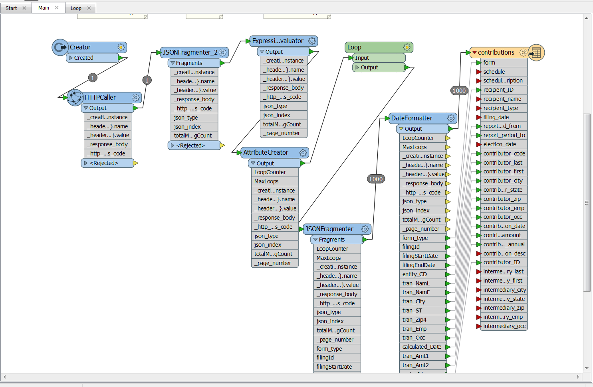
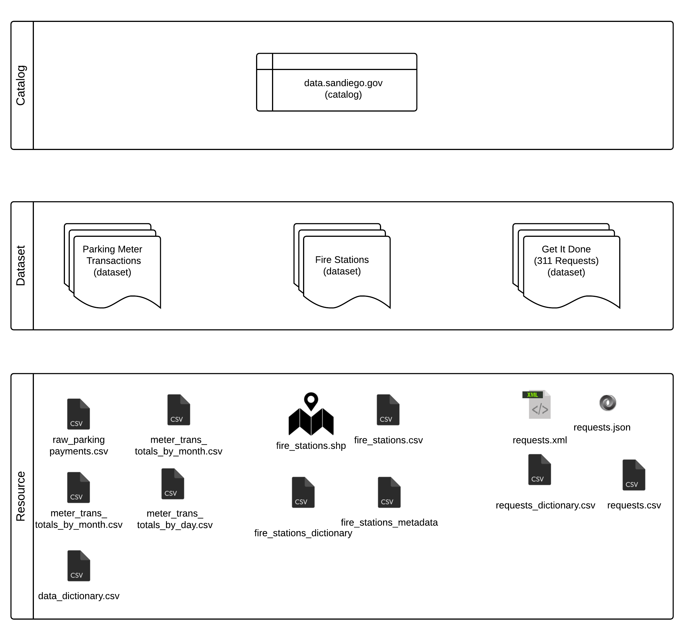

#Portal Launch

##Picking a portal

At its most basic, an open data portal is really just a website containing a catalog of City data. We needed this catalog to be as easy to navigate for less technical users as for advanced users. After extensively reviewing several options for data portals, DKAN became our technology of choice. With DKAN, users can search or browse the catalog as well as filter results by topic, publishing department, or tag name. Users can download a dataset, or preview it within the website and perform basic filtering. DKAN has a content management system that allowed us to customize the content and layout of our home page to optimize usability. We were also able to add informative, non-catalog content, such as a Get Started page with a tutorial on how to use the portal and narrative Data Stories that display City data on maps and with charts.

The DKAN website is powered on the back-end by Drupal and is open source. This gave us two distinct advantages. First, the recent website redesign at sandiego.gov is built with Drupal, so we have people all over the City who have been trained in using that technology. Second, open source means we can capitalize on the knowledge of a large community of developers who are contributing code, as well as contribute our own code to improve the product. We also have the flexibility to switch portal providers at a minimal cost if at some point we no longer wish to do business with GovDelivery \(the vendor hosting DKAN for us\).

Another important aspect of DKAN is that it complies with the federal DCAT schemas. DCAT stands for Data Catalog Vocabulary, and it sets standards to follow for governments publishing data. For example, each dataset must come with certain pieces of information, including the date it was released, and the date it was last modified. This kind of information -- data that describes data -- is also known as metadata. DCAT also gives guidance on how to organize government data catalogs. We are one of only a few cities compliant with DCAT as DKAN is the only data portal that fully supports it.

##Setting up the portal

Once procurement was completed, we had to get the portal ready. Customizing the site according to the City’s style guide, designing and populating the front page and extra content, identifying and working bugs out with the vendor, and loading all datasets took about three months. We had to juggle this work alongside our tasks for the data release process described in [Chapter 4](data_release.md).

Our kick-off meeting with the vendor occurred March 28. We met our project manager, set our timeline and discussed our strategy for automating data updates. We set a weekly appointment for a quick check-in meeting, and got set up on a project management tool that we used to report bugs and ask questions. Following the meeting, we sent our project manager all the things his team would need to design our portal: our new City style guide, an image of San Diego to use on the homepage, and various logos.

An early version of the portal website was available for us to start working with on April 26. We received a short training over the phone on how to use it, and then we were free to start staging datasets and adding other content.

We staged 44 datasets, solicited final feedback and made all requested changes to them between April 26 and our soft launch on June 22. For more information about the full data release process, please see [Chapter 4](data_release.md), but here is an overview of staging a dataset:

* Uploading a sample that we had refined previously with our information coordinators

* Filling in various pieces of metadata, such as how often the dataset would be updated

* Creating and uploading a data dictionary

* Adding a title and description

The portal also needed content other than datasets. DKAN provides the ability to create and embed visualizations into Data Stories. Portal users can get and analyze City data on their own, but some users may not have the technical skills or the background knowledge and context to create visualizations. The Data Stories pair visualizations with explanatory narrative, which is useful for datasets that need explanation. Creating data stories also shows people what’s possible with open data.

The homepage of the portal website was an opportunity for us to capture people’s interest and engage them in our program. Key items are directly at the top: a search bar, popular tags, a map from one of our data stories, and links to the Open Data informational site [datasd.org](http://www.datasd.org/) and the Performance & Analytics Department. Just below, we have helpful extra content organized by type of user: New visitors, hackers, City employees, and residents. This section was something extra we designed outside of the portal and used a creative workaround to include. Anyone might find a link in any category useful, but we wanted to prominently place the information each type of person might want to see first. Further down the page, we’ve got a few different ways people can interact with us, a set of previews for our Data Stories, and a set of icons representing our major topics. Topics are also available in a dropdown link at the top of the page.

We had to then create the content for all of the features on the homepage, including: a tutorial on how to use the portal, forms for people to use to submit projects they’ve created with open data and to get help with using data internally, an email list, and a form to submit feedback on the portal, plus four Data Stories, three of which were developed with the help and input of other City departments: one on street sweeping, another on parking meters, one on solar permits, and the last one on water quality.

###Building automation

From the beginning, the Open Data Program was meant to be an unshakeable structure, where data is timely and reliable. Part of that is automating updates to the datasets on the portal. If we promise to update a dataset daily or monthly, having an employee be responsible for this unnecessarily adds to his or her workload and subjects the data to the risk of human error. Automating is the only reliable way to ensure timely and consistent updates.

However, automation is a complex process that involves many variables. To set up the automation, we needed a direct connection to all the sources for datasets on the portal. We needed tools that can connect to the sources, extract the data, transform it for publication and then push it to the portal. For the launch of the portal, not all of these pieces were in place for automation, and we are still building the full publication pipeline. Here is a breakdown of what we have accomplished so far.

###Connections to data sources

Much of the data we targeted came from spreadsheet or text documents stored on shared drives and relational databases. We got access to the drives and read-only permissions to databases with help from the Department of IT.

Connecting to data sources was a complex and time-consuming part of our process. This process involves negotiating with departments, finding the right people to facilitate the technical part of the connection, and working with data owners to understand the data. Establishing a simple connection could take as little as a week, while more complex ones could take several months.

Connecting to a spreadsheet in a shared drive was straightforward, but relational databases are more complex. A relational database is a collection of tables that have rows and columns. Each table has a narrow focus, but tables can be related to each other through the use of keys. For example, the database containing Fire incidents has hundreds of tables, including a master table that stores a unique number for each incident. This unique number is the key. Additional tables repeat the unique incident number and then have more details about that incident. One table tracks the vehicles that were assigned to respond to the incident. Another table tracks transports of people to the hospital.

We couldn’t simply connect to a relational database and get a dataset. To get every detail about one Fire incident, you would have to find the row containing the same unique incident id from multiple tables. Database users in the City use SQL, or structured query language, to relate tables together and get customized sets of information. Often, we needed guidance from the City’s database users to be able to create the datasets we wanted for the portal.

Another more complex data source we encountered was web Application Programming Interface \(API\). One example of this is OpenDSD, which provides web access to Development Services Department’s project tracking system. Using OpenDSD, we could query the system using an approval ID to get full details about a land development application. We then transformed these details into one row in a dataset. Working with APIs can be more complex than working with a relational database, because you can’t use one query to get details from multiple tables. You often have to query tables one at a time and use results from one query as part of the next.

We were able to get connections to a lot of City-managed data sources, but for a few datasets, we had to work with vendors who provide services to the City on a contractual basis and manage the data in their own systems. For example, the City uses smart parking meters provided by IPS Group. IPS already gives the City access to parking meter data through a web interface that allows the user to select criteria and display a report. For our portal, we prefer to offer data at the most granular level that we can, so a user can choose how he or she might want to aggregate it. For this reason, and to meet the requirements of being machine readable and in an open format, we worked with IPS to get an export of all parking meter transactions for 2015 and 2016 to date in two .csv files. IPS puts these files into a folder that we can access online through FTP, and that FTP site became our data source.

###Extracting and transforming data

At about the same time that we received the early working version of our portal, we also deployed a piece of software meant to be our main ETL tool, SafeFME. ETL, or Extract, Transform and Load, is the three-phase process for extracting data from one or more sources and loading into another place.

ETL can be performed with a variety of tools and programming languages, but SafeFME allowed us to avoid writing code most of the time, which significantly sped up our process. The software also has a graphical interface that makes it easier to learn for less technical users, and it’s used widely enough that getting help online is easy. Finally, keeping most of our ETL jobs within one piece of software helps us manage them better.

######Screenshot of an ETL job in SafeFME

 

FME handles some tasks really well, such as extracting from a database using a query, aggregating or filtering the data, and moving it off to the destination. However, for other tasks, like downloading files according to a pattern from an FTP, advanced data merging or deduplicating, and creating backups of files when we can’t guarantee the stability of the source, we used lower-level programming languages such as R and Python. Our strategy is to choose the option with the least possible complexity, which is why we use FME for most tasks, but that same strategy often dictates that we use the best possible tool for the job.

Every dataset on the portal required some intervention. On the easier end of the spectrum, we simply reformatted dates to match the format recommended by DCAT. For other datasets, we had to take data structured in one way -- for instance, XML -- and transform it into rows and columns, or examine each row and test a condition before adding that row to the final dataset. This is where eliminating human error by controlling this process with our software and other scripts became critical. And as we update these datasets, we want to ensure transformations are performed the exact same way every time.

###Pushing data to the portal

Ideally, no one should spend time manually uploading datasets to the portal, but this is the area where we are still working to complete the publication pipeline.

One obstacle to this is that DKAN, the company who created our portal website, is working with the company that created our ETL tool, SafeFME, to build a direct link between the tool and the portal. DKAN is a newer company, and we knew this functionality might not be available in time for the launch of the portal.

Regardless of whether we manually uploaded a file after ETL, or that file is uploaded automatically by the software, we still need to automate initiation of the ETL job. Otherwise, a human has to open a program and hit a start button. Some of our datasets need to be updated daily, and relying on a human to remember to do that decreases the chance the data will actually get updated. We are still working on the code that will initiate ETL.

##Creating the data catalog

At launch, the portal included 44 datasets, but in DKAN, a dataset is a container. Single datasets include multiple files, or “resources,” and our total number of resources was 129. Even if related resources are grouped together into one dataset, each one took time to create and offers unique content.

This organizational model follows DCAT, which does not equate dataset to one downloadable file. Instead, a dataset is a “collection of data, published or curated by a single agent, and available for access or download in one or more formats.”\[1\] Multiple formats is one key reason for using this organizational model. If we offer a dataset of library locations as a Shapefile of points, we can also offer a .csv file containing latitude and longitude columns from within the same dataset. Offering different aggregations of data is also a possibility. Some users might find a dataset containing every parking meter transaction for an entire year too difficult to understand or too large to use on their computers. A different version of that dataset with totals by parking meter by day or month might be more useful for those users. Treating a dataset as a collection rather than one file makes finding data easier for users.

######Formats of files on the portal

File type | Description
------------ | -------------
.csv | A comma-delimited text file treats each row as a line break, and the values in the row for each column are separated by commas. These files open in text editors and spreadsheet programs.
shapefile | A shapefile is a proprietary format for geographic data. When the geographic data is points, we have provided an additional .csv with a column for latitude and a column for longitude.
.xml | XML stands for Extensible Markup Language. XML stores data values in descriptive tags that are arranged according to a hierarchy. So, each row in the data has enclosing tags, and within those are additional tags that represent each column.
.json | JSON stores data values as attribute-value pairs that are collected together into an object. Each row is an object, and the object contains an attribute for the column along with the corresponding data point as the value.

######Illustration of the DKAN hierarchy

Each dataset we created had to include metadata -- or data about that dataset. Below is a list of metadata values that are available:

* Publisher: The publishing department
* Modified Date: The date of the last change to the dataset. This field is automatically populated.
* Release Date: The date the dataset was first created. This field is automatically populated.
* Frequency: How often the dataset will update on the portal. This may be different than how often the actual data is refreshed. For example, a GIS layer of City Council district boundaries will only need to be updated when the City Council approves changes to district boundaries. This last happened in 2011. Still, our portal will update all GIS layers from their data source monthly. Alternatively, many parking meter transactions occur each hour. This data is housed in systems maintained by the vendor for our parking meters. We do not have a direct connection to their database, but they do provide a file each night that our portal will use to update that dataset.
* Identifier: A unique key developers can use to access our data through the DKAN API
* License: The licensing for the data on the portal. This value will always be “Open Data Commons Public Domain Dedication and Licence (PDDL).” We include the license on each dataset to reinforce for users how they may use the data.
* Author: This is usually the City, but some datasets originate from other agencies, such as MTS or a San Diego County agency. In those cases, the City may be an agency that publishes that data and makes it available to the public, but we have noted that the author is not the City.
* Public Access Level: This will always have a value of “Public.” We provide this piece of metadata because we want to reinforce that this data is open for the public to freely use without restrictions.

##Writing data stories

Data stories illustrate what is possible with Open Data. The stories we published showcase data that is either being used internally by City staff or externally by application developers.

* Jonathan Carey in the City Treasurer department created a map of parking meters. Users can hover over a meter point to get total number of transactions for 2015 and the total amount of revenue for 2015.
* Cody Hooven, Sustainability Program Manager in the Economic Development Department, wanted a map of permits for solar installations. CDO Maksim Pecherskiy crunched the data and mapped it for Cody’s story.
* The Environmental Monitoring and Technical Services Division of the Public Utilities Department wanted people to have access to the most recent test results at drinking water sampling site. Open Data Program Coordinator Andrell Bower helped create the map for this data story.
* Parking and parking tickets are such a popular topic for developers of mobile apps and the people who voted on the City’s data inventory, that the Open Data team wanted to take a look at street sweeping. This data story is a collection of maps that looks at the different kinds of sweeping schedules that exist in different areas of the City.

##Publicizing the launch

The portal was publicly available on June 22 at [data.sandiego.gov](http://data.sandiego.gov/). Mayor Kevin L. Faulconer’s office issued a press release announcing the launch on July 6. Chief Data Officer Maksim Pecherskiy, Council President Sherri Lightner and Council Member Mark Kersey also appeared on multiple morning news programs to promote the portal. For information about the portal’s status since launch, see [Chapter 6](portal_metrics.md).

________________
[1] Data Catalog Vocabulary. W3C Recommendation 16 January 2014. https://www.w3.org/TR/vocab-dcat/
